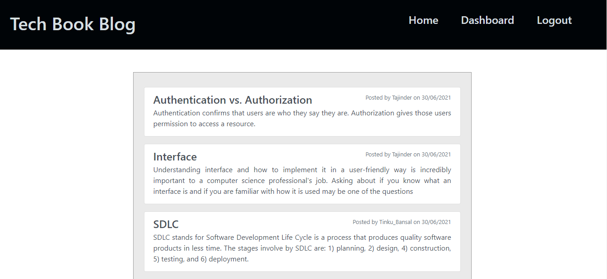
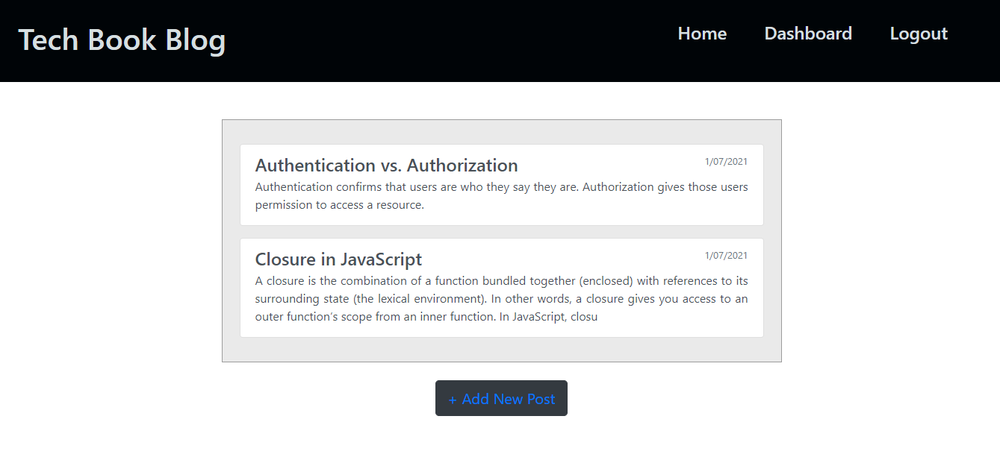
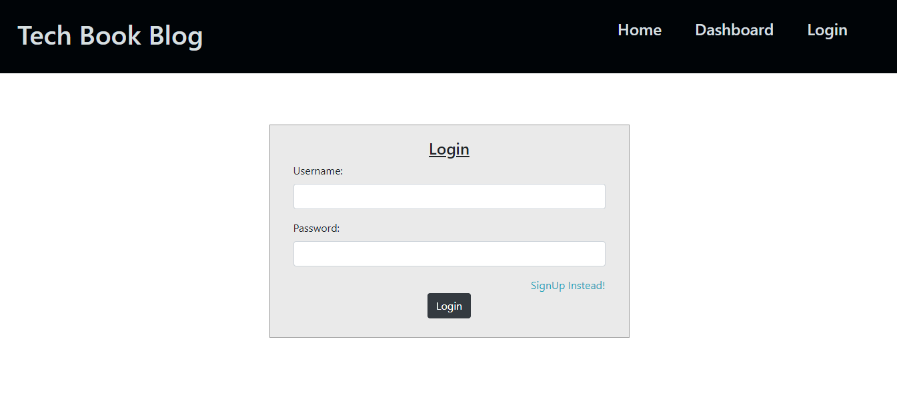
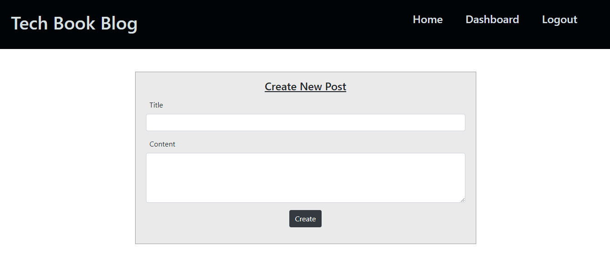
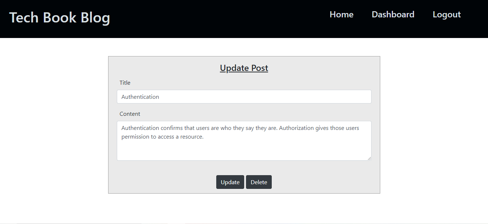
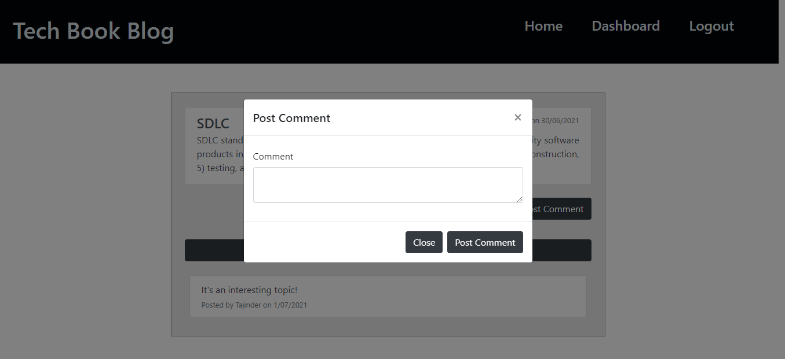
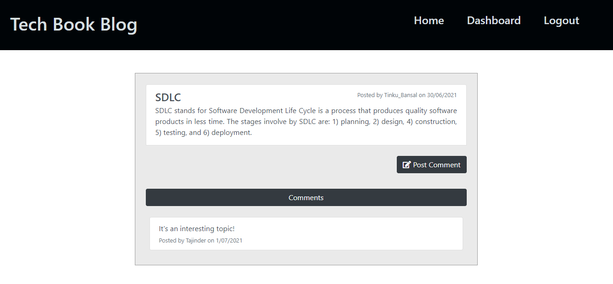

# Tech Book Blog

## Goals of the project :

`To build a CMS-style blog site similar to a Wordpress site, where developers can publish their blog posts and comment on other developers’ posts as well. This site is deployed to Heroku. This app will follows the MVC paradigm in its architectural structure, using Handlebars.js as the templating language, Sequelize as the ORM, and the express-session npm package for authentication.`

## Table of Contents

- [Link of the website](#link-of-the-website)
- [Technologies Used](#technologies-used)
- [Application Previews](#application-previews)
- [License](#license)
- [Got Any Questions](#got-any-questions)

## Link of the website:

https://techbookblog.herokuapp.com/

## Technologies Used:

- JavaScript
- JQuery
- Node.js
- Express.js
- npm
- MySQL
- Sequelize
- Session-Cookies
- Handlebars
- HTML
- CSS
- Bootstrap
- Moment.js API

## Application Previews:

## Got Any Questions

Feel free to reach me through
tinkubansal21@gmail.com

## License

Licensed under the [MIT](https://github.com/tinkubansal95/tech-blog/blob/main/LICENSE) license.

---

© 2021
